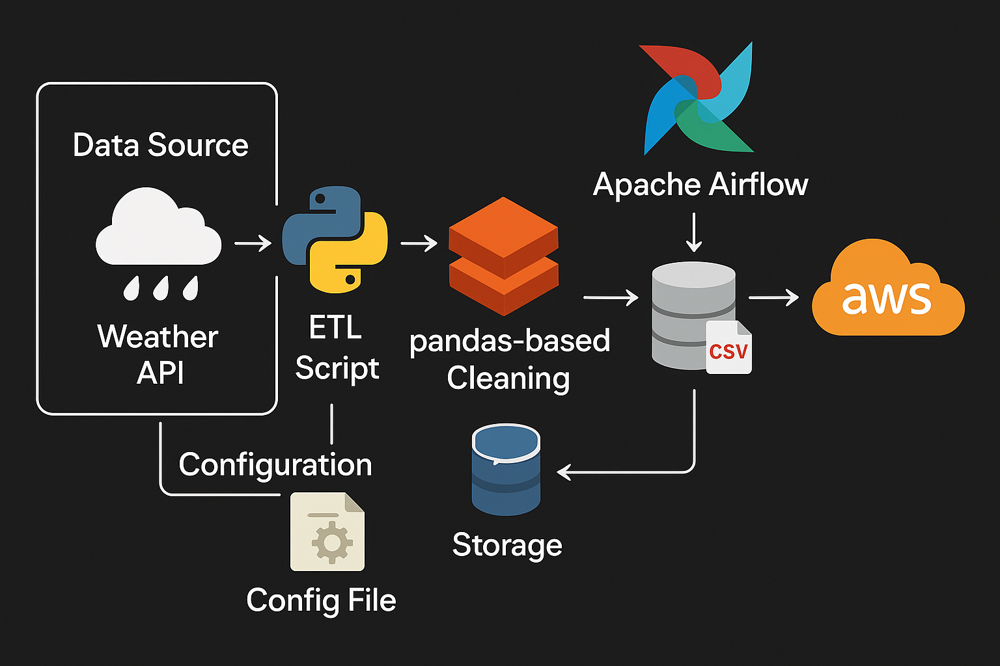

# Weather ETL Pipeline

This project is an **ETL pipeline** designed to extract weather data from the [Open-Meteo API](https://open-meteo.com/), transform it using Python and Pandas, and load it into storage using Apache Airflow for orchestration.


## 🌐 Workflow / System Design



c:\Users\ragha\Downloads\System_Design.png


## 📥 API Used
We are fetching real-time weather data using the [Open-Meteo API](https://api.open-meteo.com/v1/forecast).

### API Endpoint
```
https://api.open-meteo.com/v1/forecast?latitude=51.5074&longitude=-0.1278&current_weather=true
```


## ⚙️ Components
- **Data Source**: Open-Meteo API for weather data.
- **ETL Script**: Python script to extract, transform (clean using Pandas), and load data.
- **Orchestration**: Apache Airflow to schedule and monitor ETL workflows.
- **Storage**: Postgres database and optional CSV backups.
- **Cloud Integration**: AWS (for extended storage or deployment).


## 📂 Folder Structure
```
├── dags/
│   └── ETL_DataPipeline.py
├── Dockerfile
├── docker-compose.yaml
├── README.md
└── requirements.txt
```


## 🚀 How to Run
1. Clone the repository.
2. Build and start Airflow:
   ```bash
   docker compose up -d --build
   ```
3. Access Airflow UI at [http://localhost:8085](http://localhost:).
4. Unpause the `weather_etl_pipeline` DAG and trigger it.


## 📝 Author
- Raghav Tigadi

